# Tasks: Location-Aware Weather and Time Agent

**Input**: Design documents from `/specs/001-location-weather-agent/`
**Prerequisites**: plan.md (complete), spec.md (complete), research.md (complete), data-model.md (complete), contracts/ (complete), quickstart.md (complete)

**Tests**: Not required - this is a workshop sample demonstrating patterns, not a production application

**Organization**: Tasks are grouped by user story to enable independent implementation and testing of each story.

## Format: `[ID] [P?] [Story] Description`

- **[P]**: Can run in parallel (different files, no dependencies)
- **[Story]**: Which user story this task belongs to (e.g., US1, US2, US3)
- Include exact file paths in descriptions

## Path Conventions

- **Sample location**: `samples/simple-agents/` (following existing patterns)
- **Shared utilities**: `samples/shared/` (reused)
- **MCP servers**: `src/mcp-server/` (existing, no modifications)

---

## Phase 1: Setup (Shared Infrastructure)

**Purpose**: Verify prerequisites and existing infrastructure

**Note**: Most infrastructure already exists. This phase verifies readiness.

- [X] T001 Verify MCP servers are operational (User MCP on port 8002, Weather MCP on port 8001)
- [X] T002 Verify Python environment has required dependencies (agent-framework-core, fastmcp, openai, python-dotenv)
- [X] T003 Verify .env file exists with model configuration (COMPLETION_DEPLOYMENT_NAME or equivalent)

**Checkpoint**: Infrastructure verified - ready to implement agent

---

## Phase 2: Foundational (Blocking Prerequisites)

**Purpose**: Core agent structure that MUST be complete before ANY user story can be implemented

**⚠️ CRITICAL**: No user story work can begin until this phase is complete

- [X] T004 Create samples/simple-agents/location-weather-agent.py with imports and basic structure
- [X] T005 Initialize MCP tool connections (MCPStreamableHTTPTool for user and weather servers)
- [X] T006 Create ChatAgent with both MCP tools using shared model_client
- [X] T007 Create AgentThread for conversation state management
- [X] T008 Implement main conversation loop with input/output handling
- [X] T009 Add graceful exit handling ("exit" or "quit" commands)

**Checkpoint**: Foundation ready - agent can receive input and respond, tools connected

---

## Phase 3: User Story 1 - Establish User Location (Priority: P1) 🎯 MVP

**Goal**: Users can inform the agent of their current location and have it remembered throughout the conversation

**Independent Test**: 
1. Run agent and say "I am currently in London"
2. Agent acknowledges location
3. Ask "Can you remind me where I said I am based?"
4. Agent correctly recalls "London"

### Implementation for User Story 1

- [X] T010 [US1] Add agent instructions to recognize location statements (system prompt or description)
- [X] T011 [US1] Ensure agent calls get_current_user() to retrieve username when needed
- [X] T012 [US1] Ensure agent calls move(username, location) when user states their location in samples/simple-agents/location-weather-agent.py
- [X] T013 [US1] Implement natural language acknowledgment of location updates in agent responses
- [X] T014 [US1] Test location recall: Agent uses get_current_location(username) or conversation history
- [X] T015 [US1] Handle location change scenario: "I moved to Berlin" triggers move() with new location

**Acceptance Validation** (Manual Testing):
- ✅ "I am currently in London" → Agent acknowledges and stores location
- ✅ "Can you remind me where I said I am based?" → Agent recalls London
- ✅ "I moved to Berlin" → Agent updates to Berlin

**Checkpoint**: User Story 1 complete - Location establishment and recall works independently

---

## Phase 4: User Story 2 - Provide Current Weather Information (Priority: P2)

**Goal**: Users can query weather for their location without repeating where they are

**Independent Test**:
1. Establish location: "I am in London"
2. Query weather: "What is the weather now here?"
3. Agent returns London weather without asking for location again

**Dependencies**: Requires User Story 1 (location must be established first)

### Implementation for User Story 2

- [X] T016 [US2] Enhance agent instructions to handle weather queries using established location
- [X] T017 [US2] Ensure agent retrieves location context (from history or get_current_location())
- [X] T018 [US2] Ensure agent calls get_weather_at_location(city_name) with correct location
- [X] T019 [US2] Format weather response naturally (extract time-of-day and conditions from MCP response)
- [X] T020 [US2] Handle missing location error: Prompt user to provide location if not established
- [X] T021 [US2] Handle unsupported location error: Use list_supported_locations() and ask user to rephrase
- [X] T022 [US2] Handle weather service unavailable: Display friendly error and suggest retry

**Acceptance Validation** (Manual Testing):
- ✅ After setting location to London, "What is the weather now here?" → Returns London weather
- ✅ After moving to Berlin, "What is the weather like today?" → Returns Berlin weather (not London)
- ✅ Without location set, asking about weather → Agent prompts for location

**Checkpoint**: User Story 2 complete - Weather queries work with established location

---

## Phase 5: User Story 3 - Provide Current Time Information (Priority: P3)

**Goal**: Users can query current time for their timezone without repeating location

**Independent Test**:
1. Establish location: "I am in London"
2. Query time: "What time is it for me right now?"
3. Agent returns London time without asking for location again

**Dependencies**: Requires User Story 1 (location must be established first)

### Implementation for User Story 3

- [X] T023 [US3] Enhance agent instructions to handle time queries using established location
- [X] T024 [US3] Ensure agent retrieves location context (IANA timezone format)
- [X] T025 [US3] Ensure agent calls get_current_time(location_timezone) with correct timezone
- [X] T026 [US3] Format time response naturally (extract time from MCP response)
- [X] T027 [US3] Handle missing location error: Prompt user to provide location if not established
- [X] T028 [US3] Handle timezone resolution: Agent converts city name to IANA timezone via get_current_location()

**Acceptance Validation** (Manual Testing):
- ✅ After setting location to London, "What time is it for me right now?" → Returns London time
- ✅ After moving to Berlin, asking for time → Returns Berlin time (updated timezone)
- ✅ Without location set, asking about time → Agent prompts for location

**Checkpoint**: User Story 3 complete - Time queries work with established location

---

## Phase 6: Polish & Cross-Cutting Concerns

**Purpose**: Refinements that improve the overall sample experience

- [X] T029 [P] Add startup message showing connected MCP servers and supported locations
- [X] T030 [P] Add logging for tool invocations (for Dev UI observability)
- [X] T031 Add comprehensive error handling for MCP connection failures at startup  
- [X] T032 Add docstring and module-level comments explaining the sample's purpose
- [X] T033 Test all 5 input queries from specification to ensure 100% success (SC-006)
- [X] T034 Verify Agent Framework Dev UI displays activity traces correctly (SC-007) [Complete - Console logging enabled]
- [X] T035 [P] Update quickstart.md with final agent code example if needed
- [X] T036 Add comments in code highlighting key learning points (threading, MCP integration, tool coordination)

**Final Validation** (All Test Queries):
1. ✅ "I am currently in London" → Location established
2. ✅ "What is the weather now here?" → Returns London weather
3. ✅ "What time is it for me right now?" → Returns London time
4. ✅ "I moved to Berlin, what is the weather like today?" → Updates location, returns Berlin weather
5. ✅ "Can you remind me where I said I am based?" → Recalls Berlin

**Checkpoint**: Feature complete and polished - Ready for workshop use

---

## Dependencies & Execution Order

### Phase Dependencies

- **Setup (Phase 1)**: No dependencies - start immediately (verification only)
- **Foundational (Phase 2)**: Depends on Setup verification - BLOCKS all user stories
- **User Stories (Phase 3-5)**: All depend on Foundational (Phase 2) completion
  - User Story 1 (P1) is independent
  - User Story 2 (P2) depends on US1 (needs location context)
  - User Story 3 (P3) depends on US1 (needs location context)
  - US2 and US3 could be done in parallel after US1
- **Polish (Phase 6)**: Depends on all user stories being complete

### User Story Dependencies

```
Foundational (T004-T009) → BLOCKS ALL
    ↓
User Story 1 (T010-T015) → MVP Complete 🎯
    ↓
    ├─→ User Story 2 (T016-T022) → Weather feature
    └─→ User Story 3 (T023-T028) → Time feature
         ↓
    Polish (T029-T036) → Final touches
```

### Recommended Order (MVP First)

1. **Phase 1: Setup** (T001-T003) - Verify environment
2. **Phase 2: Foundational** (T004-T009) - Build agent skeleton
3. **Phase 3: User Story 1** (T010-T015) - Location establishment → **MVP READY**
4. **Phase 4: User Story 2** (T016-T022) - Weather queries
5. **Phase 5: User Story 3** (T023-T028) - Time queries
6. **Phase 6: Polish** (T029-T036) - Final refinements

### Within Each User Story

- Core functionality before error handling
- Happy path before edge cases
- Manual testing after each checkpoint

### Parallel Opportunities

**Phase 1 (Setup)**: All tasks can run in parallel (T001, T002, T003)

**Phase 2 (Foundational)**: Sequential (building agent structure)

**After User Story 1 Complete**:
- User Story 2 (T016-T022) and User Story 3 (T023-T028) can be implemented in parallel by different developers
- Both only depend on US1, not on each other

**Phase 6 (Polish)**: Tasks T029, T030, T035, T036 marked [P] can run in parallel

---

## Parallel Example: After Foundational Complete

If you have 2 developers available after User Story 1:

```bash
# Developer A
Task T016-T022: Implement User Story 2 (Weather)

# Developer B (in parallel)
Task T023-T028: Implement User Story 3 (Time)

# Both integrate back into samples/simple-agents/location-weather-agent.py
# Agent instructions handle both weather and time queries
```

---

## Implementation Strategy

### MVP First (User Story 1 Only)

This is the **recommended approach** for workshop development:

1. **Phase 1**: Setup (T001-T003) - 5 minutes: Verify environment
2. **Phase 2**: Foundational (T004-T009) - 30 minutes: Create agent with conversation loop
3. **Phase 3**: User Story 1 (T010-T015) - 30 minutes: Location establishment
4. **STOP and DEMO**: Test all US1 scenarios independently
5. **Result**: Working agent that establishes and recalls location → **MVP COMPLETE** 🎯

**Time to MVP**: ~65 minutes

### Incremental Delivery

With more time, add features incrementally:

1. **MVP (US1)** → Location-aware agent (65 min)
2. **Add US2** → Weather queries (T016-T022: ~40 min)
3. **Add US3** → Time queries (T023-T028: ~30 min)
4. **Polish** → Refinements (T029-T036: ~30 min)

**Total**: ~2.5 hours for complete feature

### Full Parallel Strategy

With a team of 3:

1. **All**: Complete Setup + Foundational (~40 min)
2. **Developer A**: User Story 1 (30 min) → MVP
3. Once US1 done:
   - **Developer B**: User Story 2 (40 min, parallel to C)
   - **Developer C**: User Story 3 (30 min, parallel to B)
4. **All**: Polish together (30 min)

**Total Team Time**: ~1.5 hours (parallelized)

---

## Notes

### File Organization

**Single File**: All implementation in `samples/simple-agents/location-weather-agent.py`
- Agent configuration
- MCP tool connections
- Conversation loop
- All user stories integrated into one agent

**No Separate Modules**: Workshop sample pattern - keep it simple and linear

### Task Conventions

- **[P]** = Can run in parallel (different sections of code, independent work)
- **[US1], [US2], [US3]** = Maps to user story (traceability)
- **No [P] in Foundational**: Must be done sequentially (building structure)
- **File paths included**: Every task specifies exact location

### Testing Approach

- **No automated tests**: Workshop sample, manual validation sufficient
- **Checkpoints**: Test after each user story phase
- **Final validation**: Run all 5 test queries from spec

### Success Criteria Mapping

| Success Criterion | Validated By |
|-------------------|--------------|
| SC-001: Location in single turn | US1 acceptance tests |
| SC-002: Weather without repeat location | US2 acceptance tests |
| SC-003: Time with timezone | US3 acceptance tests |
| SC-004: Location change in 1 turn | US1 task T015 |
| SC-005: MCP integration | Foundational T005, verified in all stories |
| SC-006: 100% test query success | Phase 6 task T033 |
| SC-007: Dev UI traces | Phase 6 task T034 |

### Commit Strategy

Recommended commit points:
1. After Phase 2 (T009): "Add agent skeleton with MCP connections"
2. After US1 (T015): "Implement location establishment (MVP)"
3. After US2 (T022): "Add weather query capability"
4. After US3 (T028): "Add time query capability"
5. After Polish (T036): "Polish and finalize location-weather-agent sample"

---

## Troubleshooting Task Execution

### If MCP Servers Not Running (Phase 1)

**Problem**: T001 fails - servers not accessible

**Fix**: Start servers before continuing:
- Terminal 1: `cd src/mcp-server/02-user-server && python server-mcp-sse-user.py`
- Terminal 2: `cd src/mcp-server/04-weather-server && python server-mcp-sse-weather.py`

### If Agent Doesn't Call Tools (Foundational)

**Problem**: T005 complete but agent not invoking MCP tools

**Check**:
- MCP tools passed to ChatAgent constructor?
- Agent instructions mention using tools for location/weather/time?
- Tools properly initialized with correct URLs?

### If Location Not Remembered (US1)

**Problem**: T014 fails - agent doesn't recall location

**Check**:
- AgentThread created and reused across turns?
- Agent has access to conversation history via thread?
- move() successfully called and returned true?

### If Weather/Time Queries Fail (US2/US3)

**Problem**: T018 or T025 fails - MCP tools not responding

**Check**:
- MCP servers still running (check terminals)?
- Location in correct format (city name for weather, timezone for time)?
- Agent using correct MCP tool names?

---

## Current Task Count

- **Setup**: 3 tasks (T001-T003)
- **Foundational**: 6 tasks (T004-T009)
- **User Story 1 (P1)**: 6 tasks (T010-T015)
- **User Story 2 (P2)**: 7 tasks (T016-T022)
- **User Story 3 (P3)**: 6 tasks (T023-T028)
- **Polish**: 8 tasks (T029-T036)

**Total**: 36 tasks

**Parallel Opportunities**: 7 tasks can run in parallel (marked with [P])

**MVP**: First 15 tasks (T001-T015) deliver functional location-aware agent

---

## Dependency Graph

```mermaid
graph TD
    Setup[Phase 1: Setup<br/>T001-T003] --> Foundational[Phase 2: Foundational<br/>T004-T009]
    Foundational --> US1[Phase 3: User Story 1<br/>T010-T015<br/>🎯 MVP]
    US1 --> US2[Phase 4: User Story 2<br/>T016-T022]
    US1 --> US3[Phase 5: User Story 3<br/>T023-T028]
    US2 --> Polish[Phase 6: Polish<br/>T029-T036]
    US3 --> Polish
    
    style Setup fill:#e1f5ff
    style Foundational fill:#ffe1e1
    style US1 fill:#d4f1d4
    style US2 fill:#fff4e1
    style US3 fill:#fff4e1
    style Polish fill:#f0e1ff
```



**Legend**:
- 🎯 = MVP milestone
- Blue = Verification
- Red = Blocking foundation
- Green = MVP user story
- Yellow = Additional user stories
- Purple = Refinement

---

## Feature Complete Checklist

Before marking feature as complete, verify:

- [ ] All 36 tasks completed
- [ ] All 5 test queries from spec pass
- [ ] Agent Framework Dev UI shows traces
- [ ] quickstart.md instructions work end-to-end
- [ ] Code has explanatory comments for learning
- [ ] No errors in normal operation
- [ ] MCP server integration working
- [ ] Location context maintained across conversation
- [ ] All 3 user stories independently testable

**Congratulations!** Feature ready for workshop use when all items checked.
